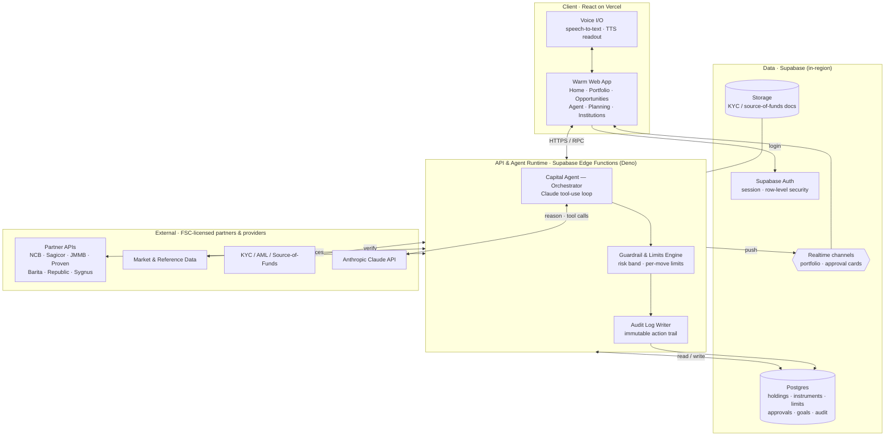
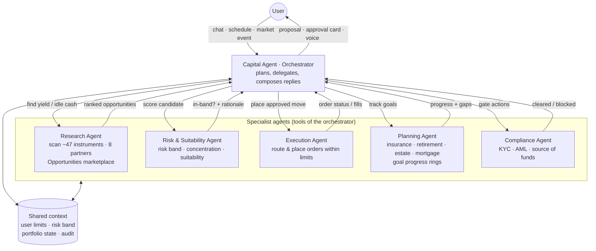
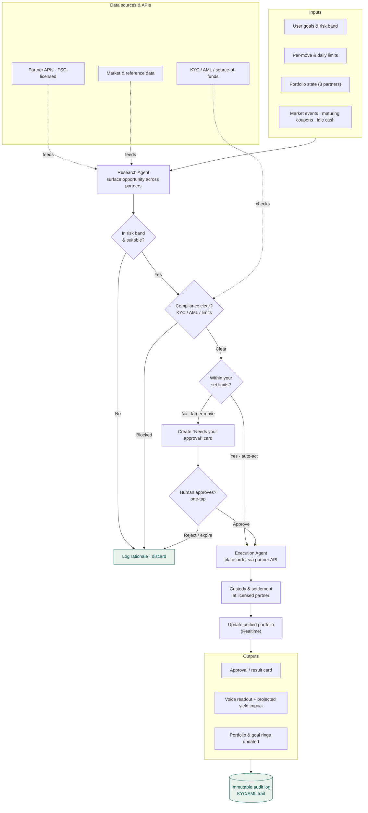
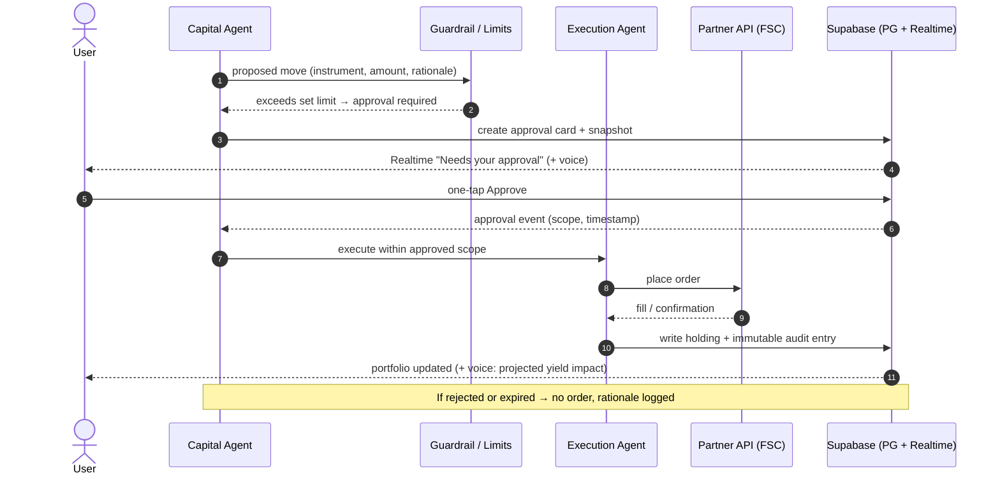
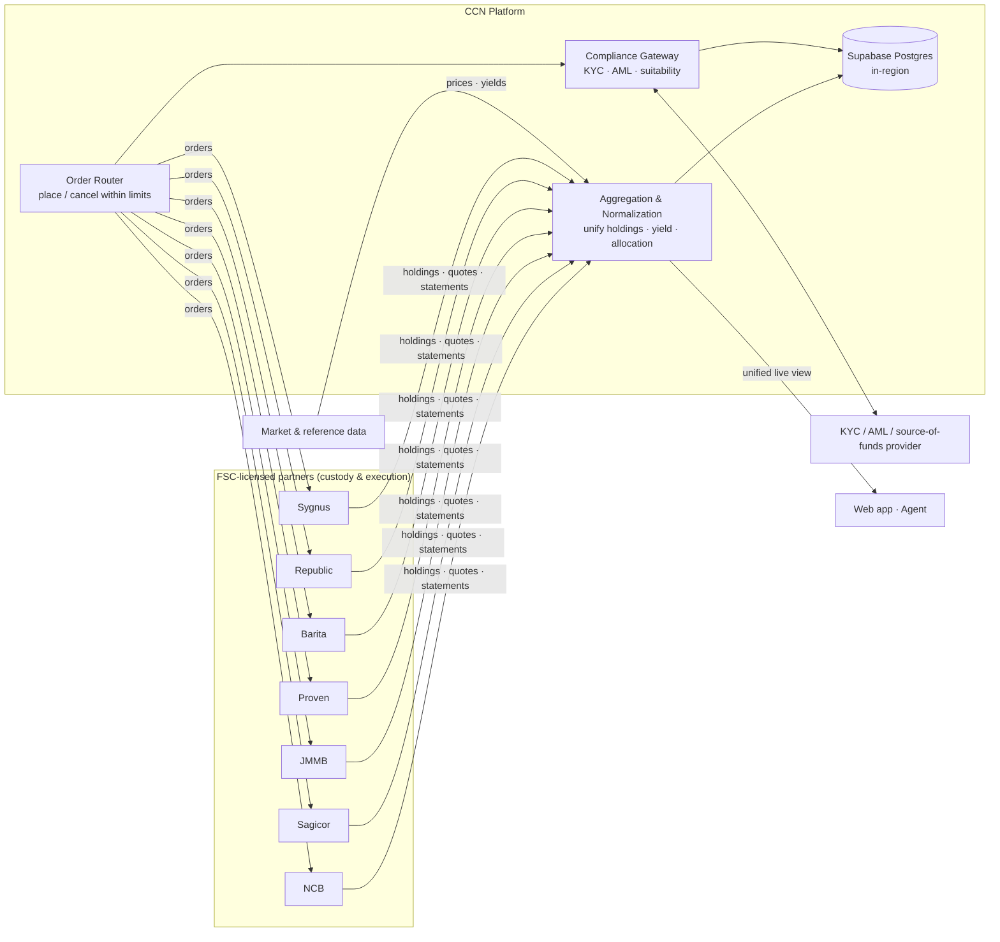
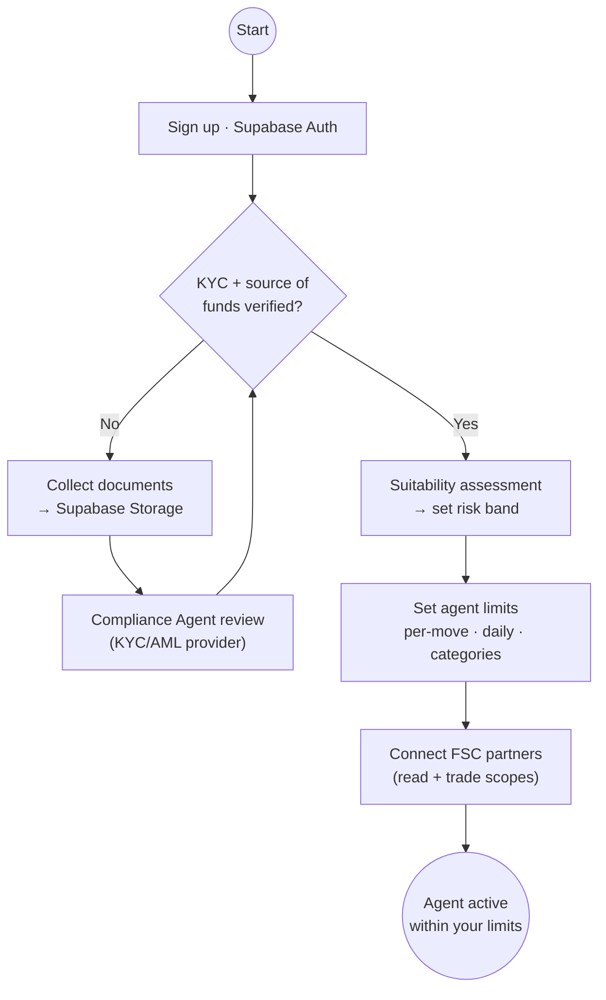

# CCN — Agentic System Design

Design of the **Caribbean Capital Network (CCN)** AI capital agent: one agent for a
whole Caribbean portfolio that researches regional opportunities, acts inside
limits you set, and escalates larger moves for approval. This document specifies
the agent architecture, orchestration, human-in-the-loop control, data sources,
and key decision points, with the workflow diagrams the design is built around.

> Diagrams are authored in Mermaid (`*.mmd`) and rendered to `exports/*.svg` and
> `exports/*.png`. GitHub renders the inline Mermaid below directly.

## Stack

A pragmatic stack that fits the product and the existing prototype (the Warm
build already ships as a React UI on Vercel):

| Layer | Choice | Why |
| --- | --- | --- |
| Client | React app on **Vercel** | Existing Warm prototype; fast static + edge delivery. Voice via Web Speech / TTS. |
| API + agent runtime | **Supabase Edge Functions (Deno)** | Server-side home for the Claude tool-use loop and the guardrail/limits engine — secrets and partner calls never touch the client. |
| Agent model | **Anthropic Claude** (tool use) | Orchestrator + specialist agents as tool-calling loops. |
| Data | **Supabase Postgres** (in-region) | Holdings, instruments, limits, approvals, goals, immutable audit log. Row-level security per user. |
| Live updates | **Supabase Realtime** | Push portfolio changes and "Needs your approval" cards to the client. |
| Docs | **Supabase Storage** | KYC / source-of-funds documents, held in-region. |
| Auth | **Supabase Auth** | Sessions; KYC-gated activation. |
| External | FSC-licensed **partner APIs**, market/reference data, **KYC/AML** provider | Custody, execution, quotes, verification. |

**Regulated & regional by construction:** every instrument is custodied and
executed by an FSC-licensed partner; KYC, suitability, and source-of-funds are
handled before the agent can act; data is held in-region.

## 1. System architecture

Where the agent runs and what it talks to.



## 2. Agent orchestration

A single **Capital Agent** orchestrator plans and delegates to specialist agents,
each exposed to it as a tool. They share context (your limits, risk band,
portfolio state, audit) so decisions are consistent.



| Agent | Responsibility | Reads | Acts on |
| --- | --- | --- | --- |
| **Capital Agent** (orchestrator) | Plans, delegates, composes replies, owns the approval loop | Shared context | Proposals, approval cards, voice |
| **Research** | Surface opportunities across ~47 instruments / 8 partners | Partner APIs, market data | Ranked candidate list |
| **Risk & Suitability** | Check against risk band, concentration, suitability | Portfolio, risk band | In-band verdict + rationale |
| **Execution** | Route and place orders **within limits** | Limits, approvals | Partner order APIs |
| **Planning** | Track insurance / retirement / estate / mortgage goals | Goals, holdings | Progress rings, gap flags |
| **Compliance** | KYC / AML / source-of-funds gating | KYC store, provider | Clear / block |

## 3. Agentic workflow — the money loop *(primary diagram)*

End-to-end: inputs → research → **decision points** → human-in-the-loop →
execution → outputs → audit. This is the diagram that answers "inputs, agent
orchestration, human-in-the-loop steps, data sources and APIs, outputs, and key
decision points."



**Key decision points**
1. **In risk band & suitable?** — Risk agent rejects anything outside your band.
2. **Compliance clear?** — KYC / AML / source-of-funds and hard limits.
3. **Within your set limits?** — the auto-act vs. escalate fork. At or below your
   limit the agent acts; above it, the move becomes an approval card.
4. **Human approves?** — one-tap Approve; reject or expiry means no order.

## 4. Human-in-the-loop approval

The escalation path in detail — how a larger move becomes an approval card and,
once approved, an executed order with an audit entry.



## 5. Data & API integration

Aggregation in, order routing out, compliance in the middle — all custodied and
executed at FSC-licensed partners.



## 6. Onboarding / KYC gate

The agent cannot act until KYC + source-of-funds are verified, a risk band is set,
and limits are configured.



## Guardrails & data model (supporting)

**Guardrails** (enforced server-side, not by the model):
- Every proposed action passes the **Limits Engine** before execution; the model
  can *propose* but cannot bypass a limit.
- Risk band and per-move / daily / category caps are user-set and stored in Postgres.
- Every action (proposed, approved, rejected, executed) is written to an
  **immutable audit log** with the KYC/AML trail.
- Partner scopes are explicit (read vs. trade); trade scope requires an active
  approval or an in-limit auto-act.

**Core tables** (illustrative): `users`, `partners`, `instruments`, `holdings`,
`limits`, `risk_profiles`, `opportunities`, `approvals`, `goals`, `audit_log`,
`kyc_documents`.

## Files

| File | Diagram |
| --- | --- |
| `01-system-architecture.mmd` | System architecture / stack |
| `02-agent-orchestration.mmd` | Orchestrator + specialist agents |
| `03-agent-workflow.mmd` | **Primary** end-to-end agentic workflow |
| `04-approval-sequence.mmd` | Human-in-the-loop approval sequence |
| `05-data-api-integration.mmd` | Data & API integration map |
| `06-onboarding-kyc.mmd` | Onboarding / KYC gate |

Rendered `*.svg` and `*.png` for each live in `exports/`. To re-render:

```bash
npx @mermaid-js/mermaid-cli -i design/agents/03-agent-workflow.mmd \
  -o design/agents/exports/03-agent-workflow.png -b white -s 2
```
