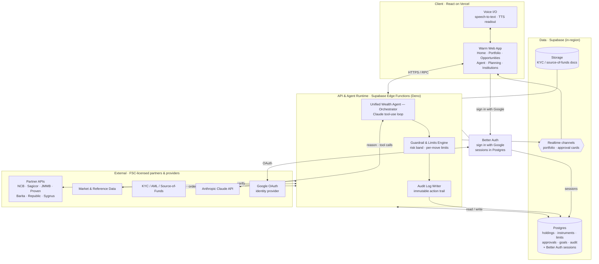
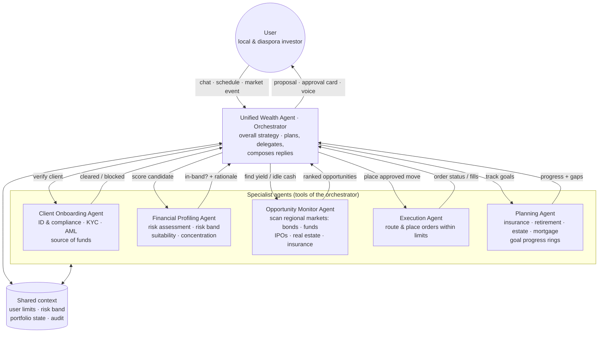
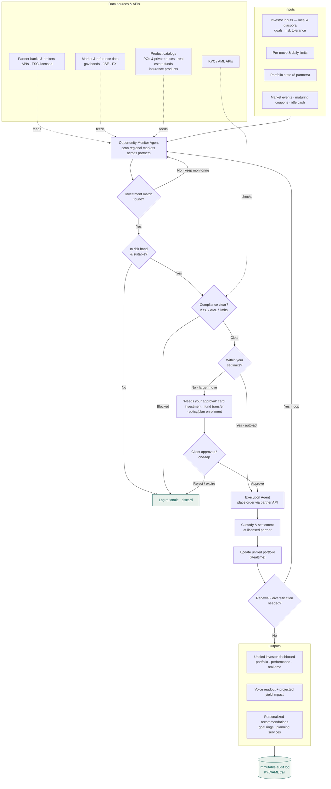
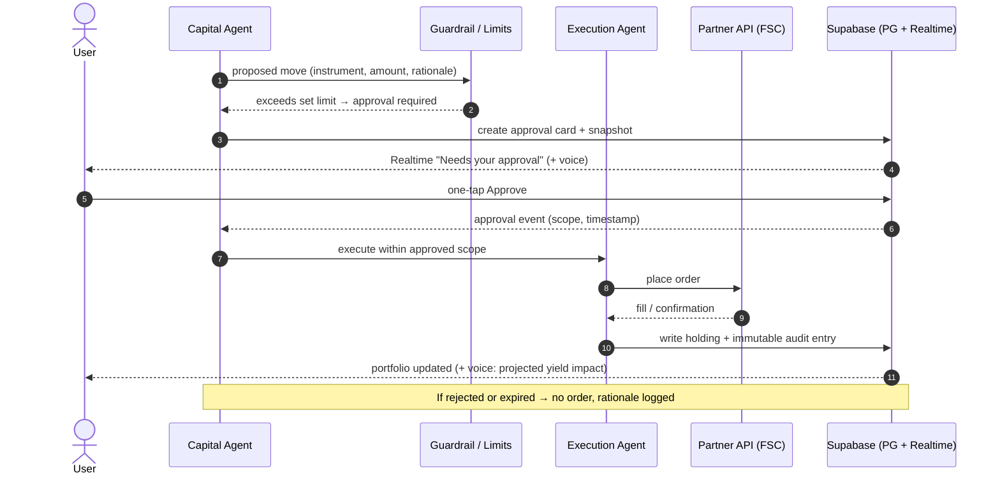
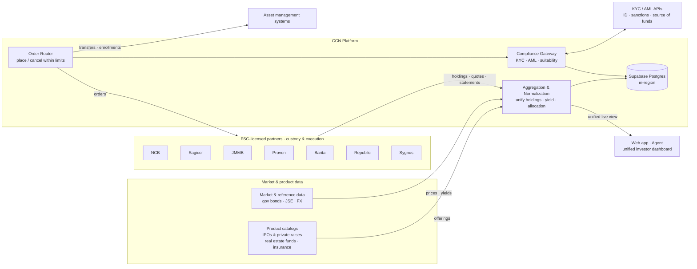
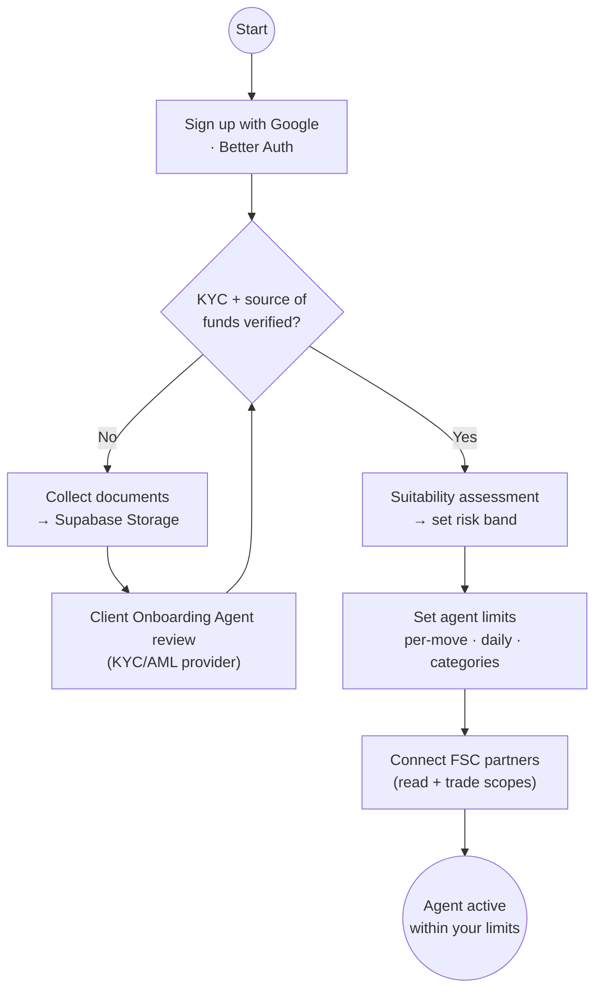

# CCN — Agentic System Design

Design of the **Caribbean Capital Network (CCN)** financial operating system and
its AI capital agent: one agent for a whole Caribbean portfolio that researches
regional opportunities, acts inside limits you set, and escalates larger moves
for approval.

**Vision:** transform Caribbean capital flows from consumption to wealth
creation — intelligent infrastructure connecting local investors *and the global
diaspora* with regional investment opportunities, delivered through a single
trusted interface for wealth creation in the Caribbean.

This document specifies the agent architecture, orchestration,
human-in-the-loop control, data sources, key decision points, the stack, the
external resources required, and the compute/model strategy.

> Diagrams are authored in Mermaid (`*.mmd`) and rendered to `exports/*.svg` and
> `exports/*.png`. GitHub renders the inline Mermaid below directly.

> **See also:** [Background Agent Workflow — Research to Decision](./background-workflow.md)
> specifies how each background agent works stage by stage, **grounded in the
> codebase as built** (`packages/agent/src/pipeline.ts`,
> `apps/api/src/services/agent-sweep.ts`, `packages/limits-engine`), with a
> phased roadmap. This README predates the build and keeps the original
> vision-level spec; where the two differ, the workflow doc describes the
> working system.

## Stack

A pragmatic stack that fits the product and the existing prototype (the Warm
build already ships as a React UI on Vercel):

| Layer | Choice | Why |
| --- | --- | --- |
| Client | React app on **Vercel** | Existing Warm prototype; fast static + edge delivery. Voice via streaming STT/TTS. |
| Auth | **Better Auth** — sign in with Google | Simpler social-sign-on DX than Supabase Auth for a Google-first signup flow. Runs in the server runtime; sessions and accounts persist in the same Postgres. |
| API + agent runtime | **Supabase Edge Functions (Deno)** | Server-side home for the Claude tool-use loop and the guardrail/limits engine — secrets and partner calls never touch the client. |
| Agent models | **Anthropic Claude** (tool use, tiered — see [Compute & models](#compute--model-strategy)) | Orchestrator + specialist agents as tool-calling loops. |
| Data | **Supabase Postgres** (in-region) + **pgvector** | Holdings, instruments, limits, approvals, goals, immutable audit log, auth sessions, document embeddings. |
| Live updates | **Supabase Realtime** | Push portfolio changes and "Needs your approval" cards to the client. |
| Docs | **Supabase Storage** | KYC / source-of-funds documents, held in-region. |
| Batch compute | Serverless batch (e.g. **Modal** / AWS Batch) | Market-scan sweeps, Monte Carlo goal projections, portfolio optimization, re-embedding jobs. |
| External | FSC-licensed **partner APIs**, market/product data, **KYC/AML APIs**, asset management systems | Custody, execution, quotes, offerings, verification, transfers/enrollments. |

**Regulated & regional by construction:** every instrument is custodied and
executed by an FSC-licensed partner; KYC, suitability, and source-of-funds are
handled before the agent can act; data is held in-region.

## 1. System architecture

Where the agent runs and what it talks to. Sign-in is Google OAuth via Better
Auth; sessions live in the same Postgres as the portfolio data.



## 2. Agent orchestration

A single **Unified Wealth Agent** (the capital agent) owns overall strategy. It
plans and delegates to specialist agents, each exposed to it as a tool. They
share context (your limits, risk band, portfolio state, audit) so decisions are
consistent.



| Agent | Responsibility | Reads | Acts on |
| --- | --- | --- | --- |
| **Unified Wealth Agent** (orchestrator) | Overall strategy; plans, delegates, composes replies, owns the approval loop | Shared context | Proposals, approval cards, voice |
| **Client Onboarding** | ID & compliance — KYC / AML / source-of-funds gating | KYC store, KYC/AML APIs | Clear / block |
| **Financial Profiling** | Risk assessment — risk band, concentration, suitability | Portfolio, risk band | In-band verdict + rationale |
| **Opportunity Monitor** | Scan regional markets — bonds, funds, IPOs & private raises, real estate, insurance across ~47 instruments / 8 partners | Partner APIs, market & product data | Ranked candidate list |
| **Execution** | Route and place orders **within limits** | Limits, approvals | Partner order APIs, asset mgmt systems |
| **Planning** | Insurance / retirement / estate / mortgage goals | Goals, holdings | Progress rings, gap flags |

## 3. Agentic workflow — the money loop *(primary diagram)*

End-to-end: inputs → research → **decision points** → human-in-the-loop →
execution → outputs → audit. This is the diagram that answers "inputs, agent
orchestration, human-in-the-loop steps, data sources and APIs, outputs, and key
decision points."



**Key decision points**
1. **Investment match found?** — the Opportunity Monitor keeps scanning until a
   candidate fits the investor's goals; no match → keep monitoring.
2. **In risk band & suitable?** — the Financial Profiling agent rejects anything
   outside your band.
3. **Compliance clear?** — KYC / AML / source-of-funds and hard limits.
4. **Within your set limits?** — the auto-act vs. escalate fork. At or below your
   limit the agent acts; above it, the move becomes an approval card.
5. **Client approves?** — one-tap Approve on three card types: **investment
   recommendation**, **fund transfer authorization**, **policy/plan enrollment**.
   Reject or expiry means no order.
6. **Renewal / diversification needed?** — after settlement the loop re-enters
   monitoring (e.g. reinvest a maturing coupon, rebalance concentration).

## 4. Human-in-the-loop approval

The escalation path in detail — how a larger move becomes an approval card and,
once approved, an executed order with an audit entry.



## 5. Data & API integration

Aggregation in, order routing out, compliance in the middle — all custodied and
executed at FSC-licensed partners.



## 6. Onboarding / KYC gate

The agent cannot act until KYC + source-of-funds are verified, a risk band is set,
and limits are configured. Sign-up is one tap with Google.



## External resources & integrations

What CCN needs from outside the codebase, roughly in order of criticality:

| Category | Resource | Used for |
| --- | --- | --- |
| Partner access | API agreements with FSC-licensed institutions — NCB, Sagicor, JMMB, Proven, Barita, Republic, Sygnus (+ future partners, e.g. GraceKennedy) | Holdings feeds, quotes, statements, order placement, custody & settlement |
| Market data | JSE market feed · BOJ/MoF government bond auction data · FX rates (JMD/USD/TTD/BBD) · fund NAVs | Pricing, yield calc, opportunity scanning |
| Product catalogs | IPO & private raise listings, real estate fund offerings, insurance product details | Opportunities marketplace, Planning agent |
| Identity | Google Cloud OAuth credentials (Better Auth) | Sign up / sign in with Google |
| KYC / AML | KYC provider (e.g. Smile ID / Onfido / Persona) + sanctions & PEP screening (e.g. ComplyAdvantage) | Onboarding gate, per-action compliance checks |
| AI | Anthropic API (Claude, tiered) · embeddings provider (e.g. Voyage) | Agents, retrieval |
| Voice | Streaming STT + TTS provider (e.g. Deepgram / ElevenLabs; Web Speech fallback) | Voice input and spoken agent responses |
| Hosting | Vercel (client) · Supabase (runtime, data, realtime, storage — nearest in-region deployment) | Platform |
| Batch compute | Modal / AWS Batch (or similar serverless batch) | Simulations, sweeps, re-embedding (below) |
| Asset mgmt | Asset management system integrations | Fund transfers, policy/plan enrollment |
| Observability | Error tracking (Sentry) · agent tracing/evals (e.g. Braintrust/LangSmith) | Reliability, agent quality regression |

## Compute & model strategy

Where heavy compute pays off, and how to spend it without runaway cost:

**Model tiering (Claude)**
- **Orchestrator & proposals** — a frontier model (Opus/Sonnet class) for
  strategy, multi-step tool use, and composing rationale the user will read.
- **High-volume classification** — a small fast model (Haiku class) for intent
  routing, alert triage, transaction tagging, and first-pass instrument
  screening. The Opportunity Monitor screens wide with the small model and
  escalates shortlisted candidates to the big one.
- **Prompt caching + response caching** — portfolio context and instrument
  briefs are cached; identical research questions reuse cached briefs.

**Batch inference (cheap bulk compute)**
- Nightly **market sweep**: score the full instrument universe (today ~47; at
  scale every JSE listing, bond auction, fund fact sheet) via the Batch API at
  off-peak pricing → a pre-scored opportunity pool the live agent queries
  instantly instead of reasoning from scratch.
- Nightly **re-embedding** of prospectuses, fund fact sheets, policy documents
  into pgvector for retrieval-augmented answers.

**Numeric compute (not LLM)**
- **Monte Carlo goal projections** (retirement, education, estate) and
  **portfolio optimization / stress tests** run as serverless batch jobs
  (Modal / AWS Batch), triggered by the Planning agent; results land in
  Postgres and render as goal rings and projected-impact numbers.
- Optional later: yield-curve / FX forecasting models trained offline (GPU) and
  served as cheap inference endpoints feeding the Opportunity Monitor.

**Document intelligence**
- Vision-capable model or dedicated OCR (Textract / Document AI) for KYC
  documents and for partners that only provide PDF statements — turning
  statements into structured holdings where no API exists yet. This is the
  pragmatic bridge while partner API agreements are negotiated.

**Guardrail principle for all of it:** heavy compute generates *candidates and
projections*; the Limits Engine and the human approval loop remain the only
paths to an executed action.

## Guardrails & data model (supporting)

**Guardrails** (enforced server-side, not by the model):
- Every proposed action passes the **Limits Engine** before execution; the model
  can *propose* but cannot bypass a limit.
- Risk band and per-move / daily / category caps are user-set and stored in Postgres.
- Every action (proposed, approved, rejected, executed) is written to an
  **immutable audit log** with the KYC/AML trail.
- Partner scopes are explicit (read vs. trade); trade scope requires an active
  approval or an in-limit auto-act.

**Core tables** (illustrative): `users`, `sessions` (Better Auth), `partners`,
`instruments`, `holdings`, `limits`, `risk_profiles`, `opportunities`,
`approvals`, `goals`, `audit_log`, `kyc_documents`, `embeddings` (pgvector).

## Files

| File | Diagram |
| --- | --- |
| `01-system-architecture.mmd` | System architecture / stack |
| `02-agent-orchestration.mmd` | Orchestrator + specialist agents |
| `03-agent-workflow.mmd` | **Primary** end-to-end agentic workflow |
| `04-approval-sequence.mmd` | Human-in-the-loop approval sequence |
| `05-data-api-integration.mmd` | Data & API integration map |
| `06-onboarding-kyc.mmd` | Onboarding / KYC gate |
| `07-background-research-to-decision.mmd` | Background workflow: research → decision (see [background-workflow.md](./background-workflow.md)) |

Rendered `*.svg` and `*.png` for each live in `exports/`. To re-render:

```bash
npx @mermaid-js/mermaid-cli -i design/agents/03-agent-workflow.mmd \
  -o design/agents/exports/03-agent-workflow.png -b white -s 2
```
