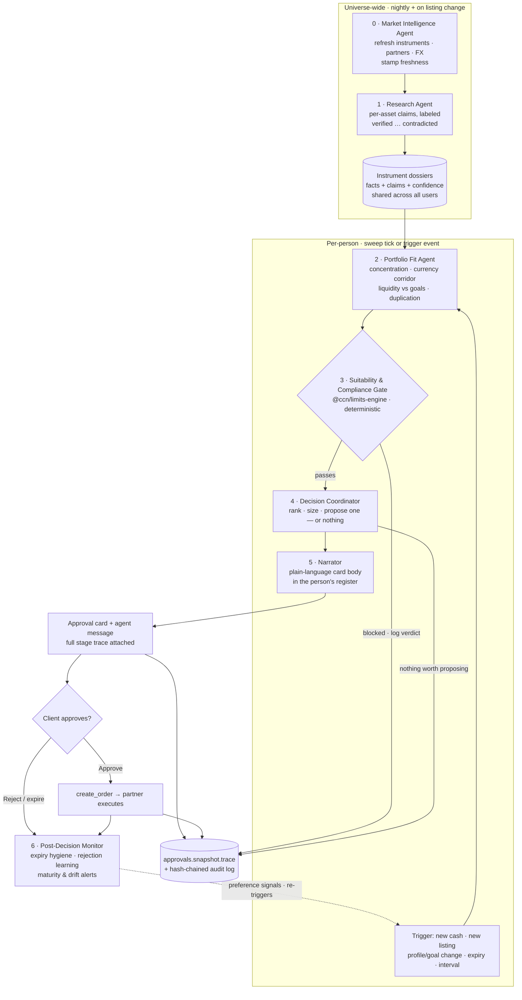

# Background Agent Workflow — Research to Decision

How each agent works in the background, from researching an asset to putting a
decision in front of the client. This document reflects the **codebase as
built** (`packages/agent/src/pipeline.ts`, `apps/api/src/services/agent-sweep.ts`,
`packages/limits-engine`) and specifies how each stage should grow from what
exists today into a full research-to-decision pipeline. Where the older
[README](./README.md) describes the original vision, this document describes
the working system and its next concrete steps.

**The one-sentence version:** shared, cached *research* happens once per asset;
per-person *fit* happens once per investor; a deterministic *gate* — never a
model — decides what is proposable; a *coordinator* picks at most one thing (or
nothing); a cheap *narrator* explains it honestly; and a *monitor* learns from
what the person does with it. Every stage leaves a trace a human can read.

---

## 1. Principles (inherited from the codebase's invariants)

These are already enforced in code and every stage below must preserve them:

1. **Models propose and explain; deterministic code decides.**
   `@ccn/limits-engine` is the single gate to `create_order`, pure and
   fixed-order. No LLM output ever overrides a gate verdict — upstream stages
   may *pre-filter* with the gate, never re-litigate it.
2. **Every stage leaves a `StageTrace`.** The trace persists on
   `approvals.snapshot.trace`, so "how was this decided?" — including why the
   losers lost — has an answer a person, a compliance officer, or a regulator
   can read. A pipeline that cannot show its handoffs is indistinguishable
   from a single loop with a marketing name.
3. **All free text enters prompts through `untrustedBlock()`.** Issuer
   descriptions, news, statements, and anything else not written by us is
   structurally quarantined; the read-only tool assertion
   (`assertReadOnly()`) runs every turn and in CI.
4. **Background work runs inside the person's own RLS tenant context**, and
   every proposal appends a hash-chained `audit_log` row (`agent.proposed`).
5. **The background agent never moves money.** Even an `auto_act` verdict
   becomes an approval card — auto-act exists for moves the person initiated.
6. **Tier the models; budget the tokens.** Cheap models screen wide, expensive
   models judge narrow (the `general`/`high`/`low` tiering already used by
   `packages/agent/src/gateway/provider.ts`). Cache aggressively
   (`packages/agent/src/cache.ts`), and give every run a token budget and a
   telemetry row.

---

## 2. The workflow at a glance

Source: [`07-background-research-to-decision.mmd`](./07-background-research-to-decision.mmd)

The universe-wide half runs **once per asset** regardless of how many
investors exist; the per-person half runs **once per investor** and reads the
shared dossiers. This is the single most important cost-and-quality decision
in the design: research is expensive and identical for everyone, so it is
never repeated per user.

---

## 3. The agent roster

Each agent is specified the same way: purpose, trigger, inputs, the
deterministic/LLM split, model tier, outputs, failure modes, and guardrails.
The stage names extend the existing `PipelineStageName` union
(`research | suitability | coordination`) rather than replacing it.

### Stage 0 — Market Intelligence Agent (universe-wide ingestion)

*The stage that makes research possible: fresh, stamped facts.*

| | |
| --- | --- |
| **Purpose** | Keep the instrument universe, partner statuses, and FX rates fresh and provenance-stamped, so downstream stages reason over facts, not stale seeds. |
| **Trigger** | Nightly batch + `pg_notify` events on `product_listings` / instrument changes (triggers already exist in migration `0015_realtime_events`). |
| **Inputs** | `instruments`, `partners`, `product_listings`, BOJ/CBTT FX scrapers (`packages/fx-rates`), and — when integrations land — issuer disclosures, fund NAVs, JSE data, news feeds. All egress via `createOutboundGuard` (SSRF allowlist). |
| **LLM / deterministic** | Deterministic. This stage fetches, normalizes, and stamps; it does not judge. |
| **Outputs** | Per-instrument raw fact set with `source` + `asOf` on every fact; an FX staleness verdict (mirror `fx.ts`'s `STALE_AFTER_DAYS = 4` pattern). |
| **Failure modes** | A source that fails **throws and is recorded as unavailable** — never silently substituted (the `fx-rates` parsers already set this precedent with `assertPlausible`). Stale data flows downstream *flagged*, degrading confidence rather than blocking the pipeline. |
| **Guardrails** | Read-only against the world; writes only reference/dossier data, never user data. Every fetched document is untrusted input. |

### Stage 1 — Research Agent (per-asset deep dive)

*The stage the product's word "research" must actually mean.*

Today's `research` stage in `pipeline.ts` sorts by risk and minimum — ranking,
not research. The real Research Agent answers the questions a careful human
analyst would ask about the company and the asset, and it does so **once per
instrument**, cached into a shared dossier.

**The questions it must answer, as extracted claims:**

- **Issuer** — who is the issuer, who regulates them (`regulator` field:
  FSC Jamaica / Barbados / Trinidad & Tobago), what is their track record,
  and what is their relationship to the executing partner?
- **The return** — what actually backs the stated yield/metric? Government
  obligation, rental income, loan book, equity growth? What happens at
  maturity or exit?
- **The risks** — credit risk, currency of denomination vs the investor base,
  liquidity (can you exit early, at what penalty?), and concentration risk
  inherent to small, correlated Caribbean markets.
- **The costs** — minimum ticket, fees, GCT (`gctBps`), withdrawal charges
  (`withdrawalFeeFlatMinor`/`withdrawalFeeBps`), FX spread if the person will
  cross currencies. The dossier records enough for a **net-of-cost** view.
- **The record** — is anything about this instrument contradicted by another
  source? Has its listing status or blocked status changed recently?

| | |
| --- | --- |
| **Trigger** | New instrument, listing change, dossier older than its freshness window, or a material fact change from Stage 0. |
| **Inputs** | Stage 0 fact set, `instruments` row (`description`, `agentNote`, `metric`, `term`, `risk`, `blocked`, `blockReasons`), partner row, and any documents/news — all free text wrapped in `untrustedBlock`. |
| **LLM / deterministic** | LLM extracts **discrete claims** and labels each one's evidence `verified \| partially_verified \| self_reported \| unverified \| contradicted` — exactly the Gateway readiness pattern (`gateway/orchestrator.ts` → `assessOpportunity`). The **aggregate research-confidence score (0–100) is computed in pure arithmetic**, reusing the shape of `computeReadinessScore` in `gateway/readiness.ts` (status weights 1 / 0.6 / 0.3 / 0.1 / **−1**; required categories named explicitly when missing). The LLM never invents the final number. |
| **Model tier** | `high` — this is the judgment-heavy pass, run rarely and cached widely. |
| **Outputs** | The **instrument dossier**: claims[], confidence score, `criticalMissingItems[]`, `hasContradictedEvidence`, net-cost profile, freshness stamps. Schema-constrained via `generateObject` — never free prose. |
| **Failure modes** | LLM unavailable → the dossier falls back to seed facts only, confidence floored low and flagged `degraded`; the per-user pipeline still runs but leads with gentler, better-substantiated assets. Never fabricate a claim to fill a gap — a missing category is *named*, not imputed. |
| **Guardrails** | `hasContradictedEvidence` is a **veto**: a contradicted instrument is not proposable regardless of score (the same hard-block discipline `gateway-guardrail` applies to private deals). Prompt versions recorded per run. |

### Stage 2 — Portfolio Fit Agent (per-person)

*"Does this make sense against this person's portfolio?" — asked properly.*

The gate checks limits; fit checks **sense**. These are different questions:
a bond can clear every cap and still be the wrong idea because the person
already holds three instruments from the same issuer, or because the money it
would lock up is the money their goal needs next year.

**Deterministic portfolio math (computed in code, from `AgentSnapshot`):**

- **Concentration beyond the single-position cap** — exposure by issuer, by
  partner, by instrument `type` (bond/fund/equity/real_estate/private), by
  `region`, and by currency. Caribbean markets are small and correlated; two
  different instruments from one conglomerate are one risk.
- **Currency & corridor exposure** — holdings currency mix vs
  `user_profiles.displayCurrency`, `corridor`, and `residencyCountry`. A
  diaspora investor who spends USD holding 90% JMD assets has an FX problem
  no single-position cap sees.
- **Liquidity ladder vs goals** — each `goals` row's `targetMinor`, `pct`,
  and `eta` against the candidate's `term`. Never propose locking funds past
  a goal's ETA that the goal's funding depends on.
- **Duplication & diversification** — does the person already hold this
  instrument or a near-substitute? Does the candidate add a return source the
  portfolio lacks, or more of what it has?
- **Cash runway** — headroom above the cash floor after the proposed ticket,
  and whether recurring known outflows (withdrawal requests pending) consume it.

**One LLM pass (tier `general`)** then weighs the computed metrics into a fit
judgment it could not fake: reconciling tensions (better yield vs worse
concentration), matching income-vs-growth character to the person's goals and
band, and writing the honest rationale. Output mirrors `gateway_matches`:
`{ fitScore, reasons[], concerns[] }`, schema-constrained.

| | |
| --- | --- |
| **Trigger** | Per-person sweep tick, or an event: new cash recorded, new listing at a connected partner, risk-profile or goal change, approval decided/expired. |
| **Inputs** | Instrument dossiers (Stage 1), `AgentSnapshot` (holdings, cash, limits, band — `agent-snapshot.ts`), `risk_profiles`, `goals`, `user_profiles`, `investor_mandates` where the person has one. |
| **Failure modes** | LLM unavailable → deterministic metrics alone rank candidates, concerns auto-generated from threshold breaches, confidence flagged `degraded`. A person with no goals/profile depth gets the cold-start posture (§5). |
| **Guardrails** | Runs inside the person's tenant context. The fit score can only *narrow* what the gate allows, never widen it. |

### Stage 3 — Suitability & Compliance Gate (deterministic — no LLM)

*The line the model never crosses, unchanged.*

The existing `@ccn/limits-engine` evaluation (DB-backed via
`services/gate.ts` in the sweep, snapshot-backed in chat), in its fixed order:

1. instrument hard-blocked → blocked (curated reasons)
2. below instrument minimum → blocked
3. suitability band (`fitsSuitability`) → blocked
4. cash floor → blocked
5. single-position cap → blocked
6. daily cap → blocked
7. FX-spread over guardrail → requires approval
8. above approval threshold → requires approval
9. within auto-invest cap → auto-act; otherwise requires approval

Nothing in this document changes the gate. What changes is what reaches it:
better-researched, better-fitting candidates — and the trace now records the
gate verdict *alongside* the research confidence and fit score that preceded
it, so a rejection reads as a complete story.

### Stage 4 — Decision Coordinator

*Pick one thing, size it honestly — or pick nothing.*

| | |
| --- | --- |
| **Purpose** | Rank the survivors, choose at most one, size it properly, and decide whether proposing anything is the right move at all. |
| **Ranking** | Deterministic: research confidence × fit score × gate headroom, with tie-breaks toward lower risk and smaller minimum (preserving today's "gentlest viable first" posture). |
| **Sizing** | Today the pipeline always sizes at the instrument minimum. The coordinator instead sizes within the box bounded by: instrument minimum (floor), cash-floor headroom, single-position headroom, daily-cap headroom, auto-invest cap, and — where a goal is the motive — the goal's funding gap. The chosen size re-runs the gate before proposal (sizing must never outrun screening). |
| **The "do nothing" decision** | First-class. If the best survivor's combined score is below a proposal bar, or the person's portfolio is already well-placed, the coordinator ends the sweep with a trace entry saying so — proposing nothing beats proposing something mediocre, and it is what keeps approval cards meaning something. |
| **LLM / deterministic** | Fully deterministic. Judgment already happened in stages 1–2; the coordinator is arithmetic and policy. |
| **Outputs** | The approval payload (`type: 'investment_rec'`, instrument, amount, currency) plus the complete pipeline trace: research summary, fit reasons *and concerns*, gate verdict, sizing rationale, and the verdicts on every rejected candidate. |
| **Guardrails** | One proposal per person per sweep; nothing while a pending approval exists; quiet period respected (all exist in `agent-sweep.ts` today). Background findings are always routed as approval cards, `auto_act` verdicts included. |

### Stage 5 — Narrator / Explainer Agent

*Say it plainly, in the person's register, concerns included.*

| | |
| --- | --- |
| **Purpose** | Turn the trace into the card body and the agent-conversation message a person actually reads. |
| **Model tier** | `low` — the same tier and discipline as the Gateway's `narrateMatch`: it explains an already-made decision and **never introduces facts not in the trace**. |
| **Register** | Beginner / intermediate / research-level matching, per the existing system prompt's `WHO YOU ARE TALKING TO` rules. A beginner hears "backed by the Jamaican government, and you can't lose access to your emergency cash"; a research-level user gets the duration and the net-of-GCT yield. |
| **Honesty requirements** | The card always carries: the net-of-cost expectation (fees, GCT, FX spread), the top concern from the fit pass, what was *rejected* this sweep and why (one line), and the data-freshness caveat when any input was stale or degraded. Selling the concern is what earns trust for the recommendation. |
| **Failure modes** | LLM unavailable → deterministic template from the trace (today's string-built card body in `agent-sweep.ts` is exactly this fallback — keep it). |

### Stage 6 — Post-Decision Monitor Agent

*The decision isn't the end; it's a data point.*

| | |
| --- | --- |
| **Purpose** | Watch what happens after the card, and feed it back. |
| **Rejection learning** | A rejected approval is a preference signal. Repeated rejections of an asset type / partner / risk level raise that category's proposal bar for this person (deterministic weights read by the coordinator — not an LLM guessing moods). The signal decays; people change. |
| **Expiry hygiene** | Cards that expire un-acted are near-rejections: slow the cadence for that person rather than re-proposing louder. |
| **Held-position watch** | If a held instrument becomes `blocked`, is paused, or its dossier gains a contradicted claim, the person gets an *alert* — silence toward existing holders while blocking new money would be the worst version of caution. |
| **Maturity & renewal** | Instruments with a `term` approaching maturity re-enter the pipeline as a reinvestment trigger (the "renewal / diversification needed?" loop in the original workflow diagram, made concrete). |
| **Goal drift** | A goal falling behind its `eta` at current pace is a trigger for the fit agent to look again with that goal as the motive. |
| **LLM / deterministic** | Deterministic triggers and counters; any narration goes through Stage 5. |

---

## 4. Orchestration, scheduling, and cost

**Two cadences, deliberately different:**

- **Universe-wide (stages 0–1):** nightly batch + listing-change events.
  Output is shared and cached; cost scales with the instrument count (~dozens
  today), not the user count.
- **Per-person (stages 2–6):** the existing sweep interval
  (`AGENT_SWEEP_INTERVAL_MS`, default 10 min, `0` = kill switch) as the
  heartbeat, but per-person work **short-circuits unless something changed**
  since the last completed sweep for that person: new cash, new/changed
  listing at a connected partner, profile or goal change, an approval decided
  or expired, or a monitor trigger. The `pg_notify` bus (`ws/bridge.ts`)
  already carries most of these events — the sweep should consume them rather
  than re-deriving everything every tick.

**Cost controls:**

- Shared dossiers (the big one — research once per asset, not per user).
- Model tiering per stage (`high` for research, `general` for fit, `low` for
  narration, none for gate/coordinator/monitor).
- Response cache (`packages/agent/src/cache.ts`) for identical prompts;
  prompt caching for the stable system/context prefix.
- Per-sweep and per-day token budgets; when the budget is spent, the sweep
  degrades to deterministic-only rather than stopping.
- **Telemetry per run:** generalize `gateway_agent_runs` into an `agent_runs`
  table — pass, tier, model, `promptVersion`, tokens in/out, latency,
  confidence — so cost and quality are measurable per stage per day.

**Concurrency & failure:**

- The sweep stays serialized (the `running` flag exists); a slow sweep skips
  a tick rather than stacking.
- One person's failure never costs the others their sweep (already true —
  keep the per-user try/catch).
- Every LLM stage has a timeout and a named deterministic fallback (specified
  per stage above). The pipeline's contract: **it may degrade, it may skip,
  it must never fabricate.**

---

## 5. Considerations that are easy to miss

The user-facing quality of this system lives in these details as much as in
the pipeline itself.

**FX and corridor risk.** The investor base is local *and* diaspora
(`user_profiles.corridor`). A "7% JMD bond" can be a negative-real-return
position for someone who spends USD. Every proposal states its currency
against the person's display currency, and the fit pass treats currency
mismatch as a concern with a number attached (the BOJ/CBTT rates exist for
exactly this).

**Total-cost honesty.** The schema already knows the costs
(`gctBps`, `withdrawalFeeFlatMinor`, `withdrawalFeeBps`, FX spread bps).
The card shows the expectation **net of costs**, because "7% gross, 5.6%
after GCT and fees" is the number a fiduciary would lead with.

**Liquidity versus goals.** A goal with an `eta` is a dated liability. The
fit agent's liquidity-ladder check is what stops the agent from proposing a
5-year note with the money earmarked for next year's tuition — the kind of
mistake that is technically within every limit and still wrong.

**Proposal fatigue and the "do nothing" recommendation.** Quiet periods
(14 days), one-card-at-a-time, and pending-blocks exist. Add: the proposal
bar (coordinator §4), expiry-as-signal, and a weekly cap. An agent that
proposes rarely and well is trusted; one that proposes constantly is muted.
"Your portfolio is well-placed; I'm not proposing anything this month" is a
legitimate, confidence-building message.

**Cold start.** A person with a risk band but no history and few goals gets
the conservative posture: lowest-risk viable candidates only, smaller sizing,
and the chat agent asks profiling questions ("what's this money for?")
instead of the background agent guessing. The first proposal a new user sees
calibrates their trust permanently.

**Data freshness and provenance.** Every dossier fact carries `source` +
`asOf`. Stale inputs degrade confidence and are *disclosed on the card*
("prices as of Friday"). The FX service's `stale`/`unavailable` reporting is
the pattern; extend it to everything the agent asserts.

**Explainability and regulator-readiness.** The trace + hash-chained audit
log means every recommendation can answer, months later: what was known, what
was checked, why this and not that, and who approved it. That is the FSC
suitability defense, produced as a by-product of the architecture rather than
as paperwork.

**Model risk management.** Golden-fixture evals (extend `eval-fixtures.ts`
and the CI `agent-eval` job) for each LLM stage: known dossier in, expected
claims out; known portfolio in, expected concerns out. Prompt versions
recorded per run (`promptVersion` pattern). Drift monitoring on confidence
distributions via `agent_runs`. The kill switches stay:
`AGENT_SWEEP_INTERVAL_MS=0`, and per-stage feature flags as stages gain LLM
passes.

**Prompt-injection surface grows with real data.** Today's instrument
descriptions are house-authored. The moment issuer documents and news feeds
arrive, every one of those strings is attacker-influenced. The defenses are
already structural — `untrustedBlock()` everywhere, no mutating tools,
`assertReadOnly()` per turn and in CI — and must be applied to every new
ingestion path as a review gate, not a habit.

**The unused embeddings table.** `embeddings` (pgvector, 384-dim, HNSW) exists
with nothing populating it. Nightly re-embedding of instrument dossiers,
goals, and mandate free-text enables semantic matching — replacing the
Jaccard `deterministicSemanticProxy` in `gateway/matching.ts` and giving the
fit agent "this person's goal text sounds like income, not growth" for
cents.

**Notification channel honesty.** Approval cards surface via realtime only;
a person who doesn't open the app never learns the agent found something
before it expires. When email/push lands, expiry-bound findings should
notify — quietly, batched, respecting the fatigue rules above.

---

## 6. Phased implementation roadmap

Each phase is independently shippable and preserves every invariant in §1.

**Phase 1 — Real research + telemetry.**
Shared instrument dossiers (new table + nightly job), the Research Agent
claims pass reusing the Gateway pattern, and the `agent_runs` telemetry table.
- `packages/agent/src/research.ts` (new — claims pass, mirrors
  `gateway/orchestrator.ts`), `packages/agent/src/research-confidence.ts`
  (new — pure scoring, mirrors `gateway/readiness.ts`)
- `packages/db` migration: `instrument_dossiers`, `agent_runs`
- `apps/api/src/services/agent-sweep.ts`: nightly dossier refresh scheduled
  alongside the sweep (same composition-root discipline)

**Phase 2 — Portfolio fit + honest sizing.**
Deterministic portfolio math over `AgentSnapshot`, the `general`-tier fit
pass, and coordinator sizing beyond "always the minimum" with re-gating.
- `packages/agent/src/fit.ts` (new), `packages/agent/src/pipeline.ts`
  (extend `PipelineStageName`, thread dossier + fit into the trace)
- `apps/api/src/services/agent-snapshot.ts` (add goals, profile, currency mix)

**Phase 3 — Event-driven triggers + the monitor.**
Sweep short-circuiting on change detection, `pg_notify` consumption,
rejection-learning weights, expiry hygiene, held-position alerts, maturity
re-entry.
- `apps/api/src/services/agent-sweep.ts`, `apps/api/src/ws/bridge.ts`
  (subscribe the sweep), `packages/db` migration: per-person agent state
  (last-swept marker, category bars)

**Phase 4 — Semantic + external data.**
Populate `embeddings` nightly; wire real market/news feeds through
`createOutboundGuard`; Monte Carlo goal projections as batch jobs feeding the
fit agent's goal-drift checks.
- `packages/agent/src/gateway/matching.ts` (swap the Jaccard proxy),
  new ingestion services under `apps/api/src/services/`

**Explicit non-goals, at every phase:** no mutating agent tools, no LLM in
the gate, no background auto-execution, no proposal without a full trace.

---

## 7. File map

| Concern | Where it lives today |
| --- | --- |
| Pipeline stages + trace | `packages/agent/src/pipeline.ts` |
| Background sweep | `apps/api/src/services/agent-sweep.ts` |
| The gate | `packages/limits-engine/src/index.ts`, `apps/api/src/services/gate.ts` |
| Claims + evidence pattern | `packages/agent/src/gateway/orchestrator.ts`, `readiness.ts` |
| Deterministic match scoring | `packages/agent/src/gateway/matching.ts` |
| Model tiering | `packages/agent/src/gateway/provider.ts` |
| Injection defense | `packages/agent/src/prompt.ts` (`untrustedBlock`), `tools.ts` (`assertReadOnly`) |
| Snapshot (per-person context) | `packages/agent/src/snapshot.ts`, `apps/api/src/services/agent-snapshot.ts` |
| Telemetry precedent | `gateway_agent_runs` (`packages/db/src/schema/gateway.ts`) |
| Freshness precedent | `apps/api/src/services/fx.ts` (`STALE_AFTER_DAYS`) |
| Audit | `packages/db/src/schema/audit.ts`, `auditAppend` |
